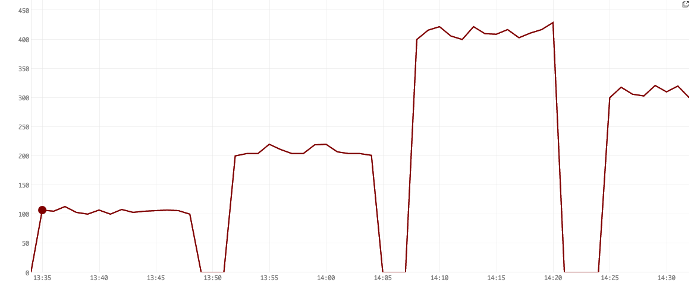
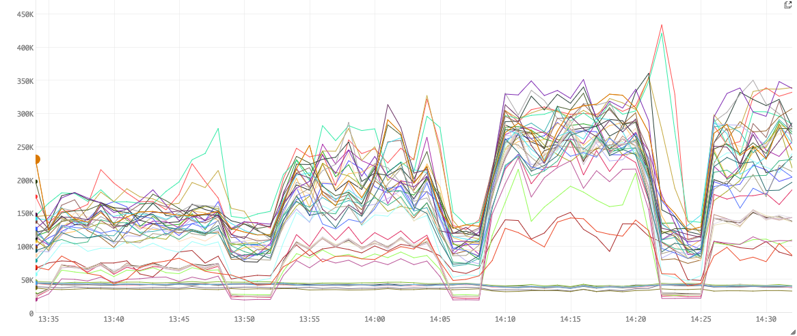
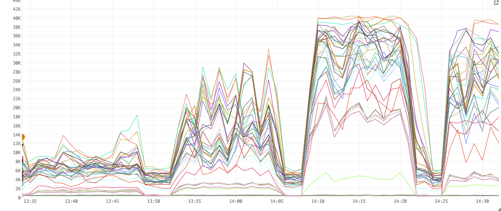
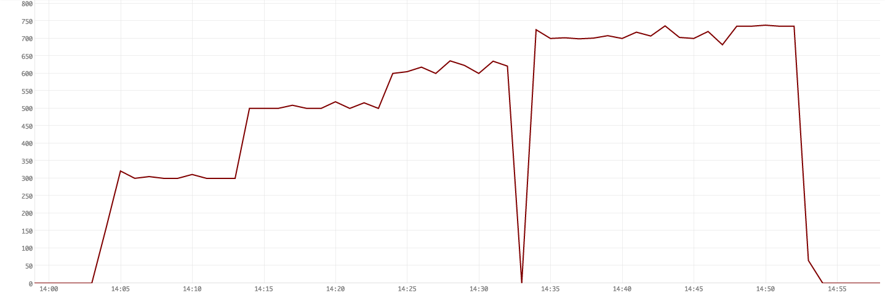
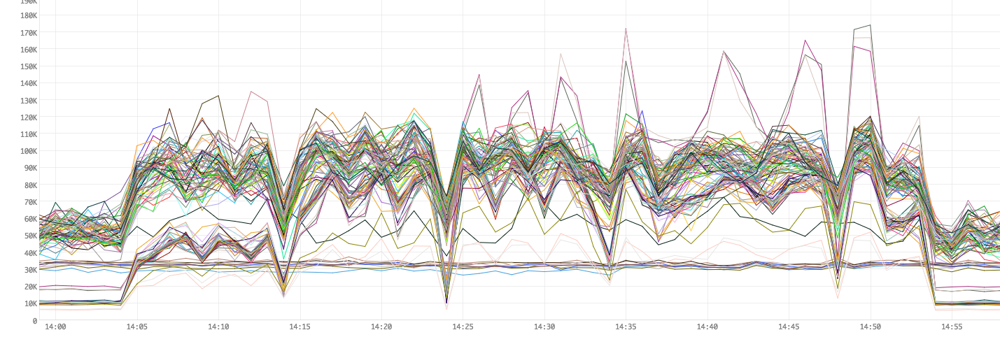
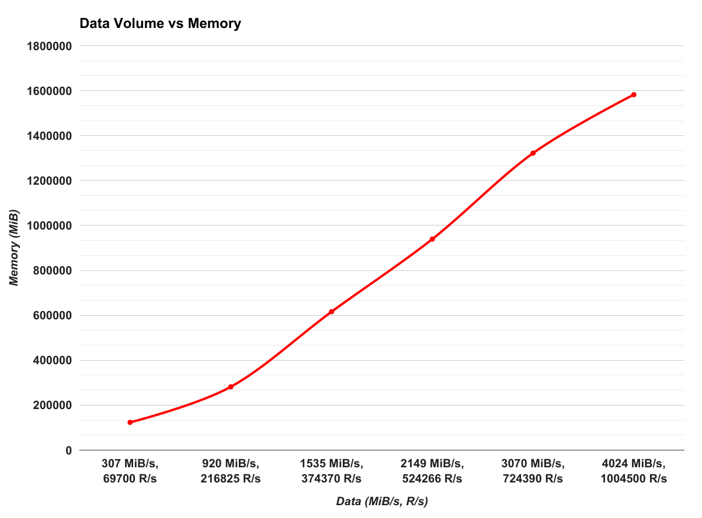
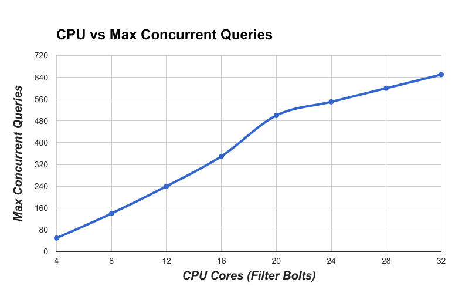
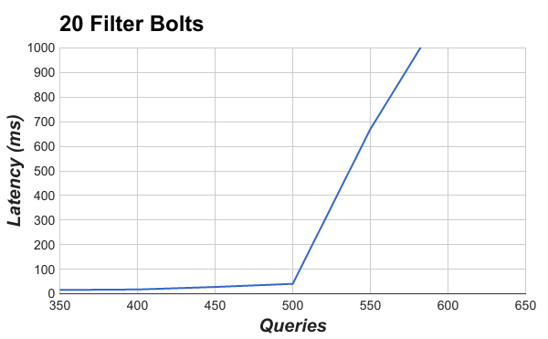

# Tuning and Performance of Bullet in Storm

The performance of a Bullet instance running on a multi-tenant Storm cluster has a lot of independent variables that we could vary and have an effect including:

1. The amount of data we consume
2. The number of simultaneous queries Bullet runs
3. The kinds of simultaneous queries - ```RAW```, ```GROUP```, ```COUNT DISTINCT```, etc.
4. Varying parallelisms of the components - increase the parallelisms of Filter bolts disproportionately to others
5. The hardware configuration of machines
6. The various Storm versions
7. How free the cluster is and the kinds of topologies running on the cluster - CPU heavy, Disk/memory heavy, network heavy etc
8. The source of the data and tuning consumption from it

...and many more.

As a streaming system, the two main features to measure is how much data it operates on and how many queries can you run simultaneously (1 and 2 above). For these results, see [performance][../performance.md]. This section will deal with determining what these are and how they vary. We will focus on 1 and 2, while keeping the others as fixed as possible. This section is to give you some insight as to what to tune to improve performance. This is not meant to be a rigorous benchmark.

## Prerequisites

You should be familiar with [Storm](http://storm.apache.org), [Kafka](http://kafka.apache.org) and the [Bullet on Storm architecture](storm-architecture.md).

##  How was this tested?

All tests run here were using [Bullet-Storm 0.4.2](https://github.com/yahoo/bullet-storm/releases/tag/bullet-storm-0.4.2) and [Bullet-Storm 0.4.3](https://github.com/yahoo/bullet-storm/releases/tag/bullet-storm-0.4.3). We are working with just the Storm piece without going through the Web Service or the UI. The DRPC REST endpoint provided by Storm lets us do just that.

Using the pluggable metrics interface in Bullet on Storm, we captured worker level metrics such as CPU time, Heap usage, GC times and types, sent them to a in-house monitoring service for time-slicing and graphing. The figures shown below use this service.

See [0.3.0](https://github.com/yahoo/bullet-storm/releases/tag/bullet-storm-0.3.0) for how to plug in your own metrics collection.

### Tools used

  * [jq](https://stedolan.github.io/jq/) - a nice tool to parse Bullet JSON responses
  * curl, bash and python - for running and analyzing Bullet queries

### Cluster

* Running a custom build of Storm - Storm 0.10.2 with Storm 1.0+ features backported. For all intents and purposes, it's Storm 1.0.3
* The spec for the machines we were running on:
    - 2 x Intel E5-2680v3 (12 core, 24 threads) - One reserved core gives each machine 47 cores from the Storm scheduler point of view
    - 256 GB RAM
    - 4 TB SATA Disk
    - 10 G Network Interface
* Multi-tenant cluster with other topologies running. Average cluster utilization ranged from *70% - 90%*
* The DRPC servers in the cluster:
    - 2 x Intel E5620 (4 cores, 8 Threads) - 16 cores
    - 24 GB RAM
    - 1 TB SATA Disk
    - 10 G Network Interface

### Data

* Our data was read from a Kafka cluster. We test with both Kafka 0.9.0.1 and 0.10.0.1
* The Kafka cluster was located within the same datacenter as the Storm cluster - close network proximity gives us some measure of confidence that large data transmission delays aren't a factor.
* The data volume can be measured by measuring how many individual records are being produced per second and what the size of the data throughput is per second.
* There is variance in the volume of data over time as this is real data. For each of the tests below, the data volume at that time will be provided in this format: ```Data: XX R/s and XX MiB/s```, where each of the numbers are the average for each metric over the hour of when the test was done. ```R/s``` is ```Records per second``` and ```MiB/s``` is ```MebiBytes per second```. The data is compressed with a compression ratio of ```1.2```.
* Our data schema contained ```92``` fields with ```62``` Strings, ```4``` Longs, ```23``` Maps and ```3``` Lists of Maps. Most of the data is generally present in the Maps and Lists of Maps.

### Configuration

Here is the default configuration we used to launch instances of Bullet.

```YAML
bullet.topology.metrics.enable: true
bullet.topology.metrics.built.in.enable: true
bullet.topology.metrics.built.in.emit.interval.mapping:
   bullet_active_queries: 5
   default: 60
bullet.topology.metrics.classes:
  - "package.containing.our.custom.class.pushing.metrics"
bullet.topology.tick.interval.secs: 1
bullet.query.default.duration: 30000
bullet.query.max.duration: 540000
bullet.query.aggregation.max.size: 512
bullet.query.aggregation.raw.max.size: 500
bullet.query.aggregation.distribution.max.points: 200
```
Any setting not listed here defaults to the defaults in [bullet_defaults.yaml](https://github.com/yahoo/bullet-storm/blob/bullet-storm-0.4.2/src/main/resources/bullet_defaults.yaml). In particular, **metadata collection** and **timestamp injection** is enabled. ```RAW``` type queries also micro-batch by size 1 (in other words, do not micro-batch).

The parallelisms, CPU and memory settings for the components are listed below.

## Testing on Kafka 0.9.0.1

For Tests 1 through 4, we read from a Kafka 0.9 cluster with the following configuration for the various Bullet components (unless specified). We use the single Spout model to read from the Kafka topic, partitioned into ```64``` partitions.

### Resource utilization

<div class="one-text-numeri-table"></div>

|     Component       | Parallelism |CPU (cores) | On Heap Memory (MiB) | Off Heap Memory (MiB) |Total Memory (MiB) |
| :------------------ | ----------: | ---------: | -------------------: | --------------------: | ----------------: |
| DataSource Spout    |64           |64          |768.0                 |192.0                  |61440              |
| Filter Bolt         |128          |128         |384.0                 |192.0                  |73728              |
| Join Bolt           |2            |1           |384.0                 |192.0                  |1152               |
| DRPC Spout          |2            |0.4         |128.0                 |192.0                  |640                |
| PrepareRequest Bolt |1            |0.2         |128.0                 |192.0                  |320                |
| ReturnResults Bolt  |1            |0.2         |128.0                 |192.0                  |320                |
| IMetricsConsumer    |1            |0.1         |128.0                 |0                      |128                |
| Ackers              |256          |25.6        |128.0                 |0                      |32768              |
| **Total**           |**455**      |**219.5**   |                      |                       |**170496**         |

With our ~47 virtual core machines, we would need ```5``` of these machines to run this instance of Bullet reading this data source and supporting a certain number of queries. What this certain number is, we will determine below.

The topology was also launched (command-line args to Storm) with the following Storm settings:

```bash
storm jar
    ...
    --bullet-spout-parallelism 64
    --bullet-spout-cpu-load 100.0 \
    --bullet-spout-on-heap-memory-load 768.0 \
    --bullet-spout-off-heap-memory-load 192.0 \
    -c topology.acker.executors=256 \
    -c topology.max.spout.pending=20000 \
    -c topology.backpressure.enable=false \
    -c topology.worker.max.heap.size.mb=4096.0 \
    -c topology.worker.gc.childopts="-XX:+UseConcMarkSweepGC -XX:+UseParNewGC -XX:NewSize=128m -XX:CMSInitiatingOccupancyFraction=70 -XX:-CMSConcurrentMTEnabled -XX:NewRatio=1" \
    ...
```

1. The spout parallelism is 64 because it is going to read from a Kafka topic with 64 partitions (any more is meaningless since it cannot be split further). It reads and converts the data into Bullet Records.
2. We've fanned out from the spouts to the Filter Bolts by a ratio of 2. We may or may not need this.
3. We use ```topology.max.spout.pending=20000``` to limit the number of in-flight tuples there can be from a DataSource Spout instance and throttle it if too many queries are slowing down processing downstream. This is set pretty high to account for catch-up and skew in our Kafka partitions
4. We have set the max heap size for a worker to ```4 GiB``` since we do not want too large of a worker. If a component dies or a worker is killed by RAS, it will not affect too many other components. It also makes heap dumps etc manageable.
5. We set ```topology.worker.gc.childopts``` to use ```ParNewGC``` and ```CMS```. These are our cluster defaults but we are listing them here since this may not be true for all Storm clusters. We have also added the ```-XX:NewRatio=1``` to the defaults since most of our objects are short-lived and having a larger Young Generation reduces our Young Generation GC (ParNew) frequency.
6. We are using 256 acker tasks. There is acking from the DataSource Spout to the Filter Bolt and from the DRPCSpout and the PrepareRequestBolt, so about ~130 components will be acking. We could get away with using much less ackers as they are very light-weight.

## Test 1: Measuring the minimum latency of Bullet

We are [running this query](../ws/examples.md#simplest-query) in this test. This ```RAW``` query without any filters will serve to measure the intrinsic delay added by Bullet. The data record pulled out has a timestamp for when the record was emitted into Kafka, Bullet will inject the timestamp into the record when the Filter Bolt sends it on and the metadata collection logs timestamps for when the query was received and terminated. Using these, we can measure the end-to-end latency for getting one record through Bullet.

### Result

The following table shows the timestamps averaged by running **100** of these queries. The delays below are shown *relative* to the Query Received timestamp (when the query was received by Bullet at the Join Bolt).

<div class="one-text-numeri-table"></div>

|    Timestamp    | Delay (ms) |
| :-------------- | ---------: |
| Kafka Received  | -710.75    |
| Bullet Filtered | -2.16      |
| Query Received  | 0          |
| Query Finished  | 1.66       |

The Bullet Filtered timestamp above is negative because the Filter Bolt received the query and emitted an arbitrary record ```2.16 ms``` before the Join Bolt received the query. The data was submitted into Kafka about ```710.75 ms``` before the query was received by Bullet and that difference is the processing time of Kafka and the time for our spouts to read the data into Bullet.

### Conclusion

Bullet adds a delay of a few ms - **```1.66 ms```** in the test above - to just pull out a record. This result shows that this is the fastest Bullet can be. It cannot return data any faster than this for meaningful queries.

## Test 2: Measuring the time to find a record

The [last test](#test-1-measuring-the-minimum-latency-of-bullet) attempted to measure how long Bullet takes to pick out a record. Here we will measure how long it takes to find a record *that we generate*. This is the average of running **100** queries across a time interval of 30 minutes trying to filter for a record with a single unique value in a field [similar to this query](../ws/examples.md#simple-filtering).

We added a timestamp into the record when the record was initially read by the DataSource Spout. Using this and the Bullet Filtered timestamp and Query Finished timestamps, we can easily track the record through Bullet.

Since we are looking at values in the data, the average data volume across this test was: ```Data: 76,000 R/s and 101 MiB/s```

### Result

<div class="one-text-numeri-table"></div>

|    Timestamp    | Delay (ms) |
| :-------------- | ---------: |
| Kafka Received  | 445.7      |
| Bullet Received | 996.5      |
| Bullet Filtered | 1003.3     |
| Query Received  | 0          |
| Query Finished  | 1006.8     |

The record was emitted into Kafka ```445.81 ms``` after the query was received. The delay is the time it takes for the generated record to flow through our network and into Kafka.

Bullet received the record ```996.5 ms``` after the query was received. The delay from when Kafka received the record to Bullet received is the delay for Kafka to make the record available for reading.

### Conclusion

We see that Bullet took on average ```1006.8 ms - 996.5 ms``` or **```10.3 ms```** from the time it saw the record first in DataSource Spout to finishing up the query and returning it in the Join Bolt.

## Test 3: Measuring the maximum number of parallel ```RAW``` queries

This test runs a query similar to the [simple filtering query](../ws/examples.md#simple-filtering). The query looks for ```10``` records that match the filter or runs for ```30``` seconds, whichever comes first. The average, uncompressed record size was about ```1.8 KiB```.

### What is meant by maximum?

We want to see how many of these queries we can have running simultaneously till the Filter Bolt is unable to process records from the spouts in time. If a Filter Bolt is unable to keep up with the rate of data produced by the spouts, our queries will not find all 10 records. Workers may start dying (killed by RAS for exceeding capacity) as well. We will be trying to find the number of queries in parallel that we can run without these happening.

The average data volume across this test was: ```Data: 85,000 R/s and 126 MiB/s```

### Query

```javascript
{
 "filters" : [
              {"field" : "id", "operation" : "==", "values": ["c39ba8cfe8"]}
             ],
 "aggregation" : {"type" : "LIMIT", "size" : 10},
 "duration" : 30000
}
```

We will run a certain number of these queries then generate records matching this query. We will validate that we have all 10 records for all queries at the end.

We ran a number of queries in parallel (you may have to use ```ulimit``` to change maximum user processes if you specify a large number), then generated data for the queries (the same data) and waited till the results came back. We then used jq to validate that all generated data was present. In a later test, we will actually measure the latency increase caused by increasing the queries.

1. It generates a provided number of the [query above](#query) and runs them in parallel against a randomly chosen DRPC server
2. It generates data for the query
3. It waits out the rest of the time and uses jq to validate that all the generated data was found

### Result

We were able to run 200 queries successfully but 300 and higher started causing our Filter Bolts to slow down. This slow down caused our spouts to be throttled and fall behind reading data. This caused the matching data to not show up in time during the queries. Some of our attempts would not return all the expected 10 records.

Using our metrics that were captured using our in-house metrics aggregation system (that our IMetricsConsumer publishes to), let's take a look at the CPU, Heap utilizations.

Before you look at the figures:

1. All the figures below are for the same time interval. The X-axis represents time in ```1 minute``` intervals
2. [Figure 1](#figure-1-queries-running) shows the number of queries running for a time interval
3. The other figures show a metric across **all** the workers (JVMs) in the Storm topology, each running a mix of a components (spouts reading from Kafka, Filter Bolts etc)
4. The majority of the components (excluding ackers) are spouts reading from Kafka or Filter Bolts, so the figures can be taken to be primarily describing those workers

#### Figure 1. Queries running



#### Figure 2. CPU user-time usage



#### Figure 3. On Heap usage


#### Figure 4. Garbage Collection times



[Figure 1](#figure-1-queries-running) shows that we first ran 100 queries, then 200, then 400 and finally 300. The numbers go over their target because we only added a 2 s buffer in our script. Network and tick delays caused some queries to not be entirely purged before the next set of N simultaneous queries came in.

[Figure 2](#figure-2-cpu-user-time-usage) shows the milliseconds of CPU time used per minute. For example, a value of ```300K ms``` ms for a line (worker) means that the worker used ```300K ms/min```  or ```300s/60s``` or ```5``` CPU cores (virtual) in that minute.

[Figure 3](#figure-3-on-heap-usage) shows raw numbers for Heap utilizations in bytes.

[Figure 4](#figure-4-garbage-collection-times) shows the time spent garbage collecting in ms.

!!! note "Garbage collection"

    As we increase the number of queries sent into Bullet, more objects are created in the Filter and Join Bolts. These quickly fill up our heap and cause GCs. The zig-zags represents heaps being cleared after GC and filling back up quickly. Also, note that the CPU usage is directly related to the GC times. In other words, performance is pretty much directly correlated with the amount of GC we do.

The following table summarizes these figures:

<div class="one-text-numeri-table"></div>

|  Simultaneous Queries  | Average CPU (ms)| Average Result size |
| :--------------------- | --------------: | ------------------: |
| 0                      |90K              | N/A                 |
| 100                    |130K             | 10                  |
| 200                    |170K             | 10                  |
| 300                    |230K             | 8.9                 |
| 400                    |270K             | 7.3                 |

### Conclusion

We are able to run somewhere between 200 and 300 ```RAW``` queries simultaneously before losing data.

## Test 4: Improving the maximum number of simultaneous ```RAW``` queries

The [last test](#test-3-measuring-the-maximum-number-of-parallel-raw-queries) showed us that the [standard configuration](#configuration) lets us run somewhere from 200 and 300 ```RAW``` queries. Let's improve that. The [GC times](#figure-4-garbage-collection-times) and the [heap usage](#figure-3-on-heap-usage) tell us that a larger heap may help. Also, since each of our machines has 256 GB of RAM and we have a lot of unused heap being wasted per machine (since we use up all the CPU cores), we can be use a lot more heap and not have to GC so much. Let's also try to make the worker even leaner by decreasing the max worker size so that slow components don't block others.

Changes:

```
-bullet.topology.filter.bolt.memory.on.heap.load: 384.0
+bullet.topology.filter.bolt.memory.on.heap.load: 1024.0

- --bullet-spout-on-heap-memory-load 768.0 \
+ --bullet-spout-on-heap-memory-load 1280.0 \

- -c topology.worker.max.heap.size.mb=4096.0 \
+ -c topology.worker.max.heap.size.mb=3072.0 \
```

Our resource utilization is now:

<div class="one-text-numeri-table"></div>

|     Component       | Parallelism |CPU (cores) |On Heap Memory (MiB) | Off Heap Memory (MiB) | Total Memory (MiB) |
| :------------------ | ----------: | ---------: | ------------------: | --------------------: | -----------------: |
| DataSource Spout    |64           |64          |**1280.0**           |192.0                  | 94208              |
| Filter Bolt         |128          |128         |**1024.0**           |192.0                  | 155648             |
| Join Bolt           |2            |1           |384.0                |192.0                  | 1152               |
| DRPC Spout          |2            |0.4         |128.0                |192.0                  | 640                |
| PrepareRequest Bolt |1            |0.2         |128.0                |192.0                  | 320                |
| ReturnResults Bolt  |1            |0.2         |128.0                |192.0                  | 320                |
| IMetricsConsumer    |1            |0.1         |128.0                |0                      | 128                |
| Ackers              |256          |25.6        |128.0                |0                      | 32768              |
| **Total**           |**455**      |**219.5**   |                     |                       | **285184**         |

Our data volume across this test was: ```Data: 84,000 R/s and 124 MiB/s```

### Result

With this configuration, we were able to run 700 queries simultaneously and failed at some where between 700 and 800. See below for why.

We notice that the GC times have improved a lot (down to ~12K ms from ~35K ms in [Figure 4](#figure-4-garbage-collection-times)). While our overall CPU usage seems to have gone down since we GC a lot less, remember that our changes to the maximum worker size makes our workers run less components and as a result, use less CPU. This is why there are more lines overall (more workers).

#### Figure 5. Queries running



#### Figure 6. CPU user-time usage



#### Figure 7. On Heap usage


#### Figure 8. Garbage Collection times


<div class="one-text-numeri-table"></div>

|  Simultaneous Queries  | Average CPU (ms)| Average Result size |
| :--------------------- | --------------: | ------------------: |
| 0                      |50K              | N/A                 |
| 300                    |80K              | 10                  |
| 500                    |95K              | 10                  |
| 600                    |100K             | 10                  |
| 700                    |100K             | 10                  |
| 735                    |105K             | 10                  |
| 800                    |105K             | 9.19                |

We seem to cap out at 735 queries. This is actually due how the blocking implementation of Storm DRPC works. Storm DRPC currently dedicates a thread to each DRPC request and does not allow more requests till they are finished. For Bullet, when we ran 800 queries for the test, only the first 735 would even be sent to Bullet. The rest 65 would be sent after some of the first return but all of those 65 would return 0 records because the data that they are looking for had long since been processed. We had ```3``` DRPC servers in the cluster and you could *scale by adding more of these*.

### Conclusion

With this change in heap usage, we could get to **```735```** of these queries simultaneously without any issues. We could do more but were limited by the number of DRPC servers in our cluster.

!!! note "735 is a hard limit then?"

    This is what our Storm cluster's configuration limits us to. There is an async implementation for DRPC that we could eventually switch to. Also, an alternative to DRPC - such as using a Pub/Sub queue like Kafka to deliver queries and retrieve results from Bullet - may be required anyway to implement Bullet on other Stream Processors.

## Testing on Kafka 0.10.0.1

For this and subsequent tests, we upgraded our Kafka cluster to 0.10. We used the new Kafka consumer APIs to read *batches* of messages instead of a message at a time. We changed our DataSource Spout to read batches of messages (raw bytes) instead and added a DataSource Bolt that converts each batch message into Bullet records. Switching to this model let us be a lot more efficient in our data reading.

To read more data, we will be trying to read a topic that is a superset of our data set so far and produces up to **13** times the number of records (maximum of 1.3 million records/sec) and **20** times the size of the data we were reading till now. This Kafka topic has **256** partitions.

## Test 5: Reading more Data

Our average data volume across this test was: ```Data: 756,000 R/s and 3080 MiB/s```

<div class="one-text-numeri-table"></div>

|     Component       | Parallelism |CPU (cores) |On Heap Memory (MiB) |Off Heap Memory (MiB) | Total Memory (MiB) |
| :------------------ | ----------: | ---------: | ------------------: | -------------------: | -----------------: |
| DataSource Spout    |128          |128         |1024.0               |192.0                 | 155648             |
| DataSource Bolt     |256          |512         |2580.0               |192.0                 | 709632             |
| Filter Bolt         |512          |512         |1024.0               |192.0                 | 622592             |
| Join Bolt           |2            |1           |512.0                |192.0                 | 1408               |
| DRPC Spout          |2            |0.4         |128.0                |192.0                 | 640                |
| PrepareRequest Bolt |1            |0.2         |128.0                |192.0                 | 320                |
| ReturnResults Bolt  |1            |0.2         |128.0                |192.0                 | 320                |
| IMetricsConsumer    |4            |0.4         |128.0                |0                     | 512                |
| Ackers              |256          |25.6        |128.0                |0                     | 32768              |
| **Total**           |**1162**      |**1179.8** |                     |                      | **1523840**        |

In terms of [our machines](#cluster), the CPU is clearly the limiting factor. We end up using about **25** machines to run this topology.

We also tweaked our GC and Storm settings. We ran the topology with the following command:

```bash
storm jar
          ...
          --bullet-conf bullet_settings.yaml \
          -c topology.max.spout.pending=30 \
          -c topology.backpressure.enable=false \
          -c topology.acker.executors=256 \
          -c topology.component.resources.onheap.memory.mb=128.0 \
          -c topology.worker.max.heap.size.mb=3072.0 \
          -c topology.worker.gc.childopts="-XX:+UseConcMarkSweepGC -XX:+UseParNewGC -XX:NewSize=128m -XX:NewRatio=2 -XX:SurvivorRatio=6 -XX:+UseCMSInitiatingOccupancyOnly -XX:-CMSConcurrentMTEnabled -XX:CMSInitiatingOccupancyFraction=50 -XX:ParallelGCThreads=8 -XX:ConcGCThreads=4" \
          ...
```

We capped the GC threads to ```8``` and ```4```, which helps performance on our 48 core machines when multiple JVMs run on a machine. We also bumped up the Young Generation size (```NewRatio=2```) and triggered the CMS collection to run at ```50%``` of Old Generation instead of the default of ```70%```. Our objects are short-lived in our streaming scenario, this makes sense. We arrived at this after a few iterations, which we'll skip here for brevity.

!!! note "Max Spout Pending is now 30 ?!"

    We use ```topology.max.spout.pending``` as a way to throttle how fast we read from Kafka. There is no acking past the Filter Bolt. The maximum number of batch messages we read is ```500``` from Kafka. This makes our true max spout pending: ```500 * 30 = 15,000```. The tuple that is emitted from the spout is a large tuple that contains up to ```500``` records and we limit up to ```30``` of those to go unacked from any single spout before we throttle it. Since we have ```128``` spouts, we can have ```128 * 15,000``` messages unacked in the topology at any time at the most.

### Result

We were able to run over 600 queries with this configuration and failed in the high 600s due to hitting the DRPC limit again. With our improved reading model and GC configs, our base resource footprint has improved from ```50K``` CPU ms/min to around ```25K``` CPU ms/min.

#### Figure 9. Queries running


#### Figure 10. CPU user-time usage


#### Figure 11. On Heap usage


#### Figure 12. Garbage Collection times


<div class="one-text-numeri-table"></div>

|  Simultaneous Queries  | Average CPU (ms)| Average Result size |
| :--------------------- | --------------: | ------------------: |
| 0                      |25K              | N/A                 |
| 100                    |35K              | 10                  |
| 300                    |60K              | 10                  |
| 500                    |85K              | 10                  |
| 600                    |90K              | 10                  |
| 680                    |95K              | 10                  |
| 700                    |95K              | 9.79                |

Note that the drops when we were running simultaneous queries in [Figure 9](#figure-9-queries-running) are due to some
hiccups in our collection mechanism (the collection granularity was not 5s as we configured but higher) and not actually drops in the simultaneous queries.

### Conclusion

We are trying to read a data source that could have```13``` times more records and ```20``` times more data volume. So we have roughly increased the parallelism of the components reading the data by 10x (```128 + 512 = 768``` cores to read and convert the data whereas previously we were using ```64``` cores). Once this is fixed and we can read the data comfortably using our DataSource Spouts and Bolts, we can scale the Filter Bolts and other components to accommodate for queries. We set our Filter Bolt parallelism (dominates the rest of the components) to ```512```. We need about ```25``` machines (5 times more than the previous of ```5```).

With this configuration, we were able to run **```680```** queries simultaneously before we hit the DRPC limit. Since DRPC is a shared resource for the cluster, this limit is slightly lower than the previously observed number possibly due to our test environment being multi-tenant and other topologies using the shared resource.

!!! note "Measuring latency in Bullet"

    So far, we have been using data being delayed long enough as a proxy for queries failing. [Bullet-Storm 0.4.3](https://github.com/yahoo/bullet-storm/releases/tag/bullet-storm-0.4.3) adds an average latency metric computed in the Filter Bolts. For the next tests, we add a timestamp in the Data Source spouts when the record is read and this latency metric tells us exactly how long it takes for the record to be matched against a query and acked. By setting a limit for this latency, we can much more accurately measure acceptable performance.

## Test 6: Scaling for More Data

For this test, we'll establish how much resources we need to read various data volumes. We want to be able to:

* Read the data
* Be able to catch up data backlogs at ```> 5 : 1``` ratio (> 5s of data in 1 s)
* Support ```> 400 RAW``` queries
* The average latency for reading a record to filtering it be ```< 200 ms```

For reading the data, we have to first scale the DataSource spouts and bolts and then set the parallelism of the Filter bolts to support the minimum 400 queries we want at the data volume. We leave the rest of the components at their default values as seen in in [Test 5](#test-5-reading-more-data).

To get various data volumes, we read a large Kafka topic with (256 partitions) with over 1 million R/s and sample various percentages to get less data. The sampling is done in our DataSource Spouts.

### Result

The following table summarizes the results:

<div class="two-one-text-numeric-table"></div>

| Data (MiB/s, R/s) | Component      | Parallelism | CPU cores | On Heap (MiB) | Total CPU cores | Total Memory (MiB) |
| :---------------- | :------------- | ----------: | --------: | ------------: | --------------: | -----------------: |
|**307, 69700**     |                |             |           |               |**98.3**         |**123648**          |
|                   |DataSource Spout|16           |0.5        |1024           |                 |                    |
|                   |DataSource Bolt |32           |2          |2048           |                 |                    |
|                   |Filter Bolt     |24           |1          |1024           |                 |                    |
|**920, 216825**    |                |             |           |               |**242.7**        |**281856**          |
|                   |DataSource Spout|32           |1          |1024           |                 |                    |
|                   |DataSource Bolt |72           |2          |2048           |                 |                    |
|                   |Filter Bolt     |64           |1          |1024           |                 |                    |
|**1535, 374370**   |                |             |           |               |**531.5**        |**616192**          |
|                   |DataSource Spout|64           |1          |1024           |                 |                    |
|                   |DataSource Bolt |160          |2          |2048           |                 |                    |
|                   |Filter Bolt     |144          |1          |1024           |                 |                    |
|**2149, 524266**   |                |             |           |               |**812.3**        |**939264**          |
|                   |DataSource Spout|72           |1          |1024           |                 |                    |
|                   |DataSource Bolt |256          |2          |2048           |                 |                    |
|                   |Filter Bolt     |224          |1          |1024           |                 |                    |
|**3070, 724390**   |                |             |           |               |**997.1**        |**1321984**         |
|                   |DataSource Spout|96           |1          |1024           |                 |                    |
|                   |DataSource Bolt |320          |2          |2580           |                 |                    |
|                   |Filter Bolt     |256          |1          |1024           |                 |                    |
|**4024, 1004500**  |                |             |           |               |**1189.4**       |**1582208**         |
|                   |DataSource Spout|96           |1          |1024           |                 |                    |
|                   |DataSource Bolt |384          |2          |2580           |                 |                    |
|                   |Filter Bolt     |320          |1          |1024           |                 |                    |

The following figures graphs how the data volume relates to the total CPU and Memory needed.

#### Figure 13. Data Volume vs CPU


#### Figure 14. Data Volume vs Memory


As these figures show, Bullet scales pretty linearly for more data.  For each core of CPU core, we need about 1.2 GiB of Memory. That is the, CPU to Memory ratio is ```1 core : 1.2 GiB```. The slopes of figures show that the CPU to data ratio is ```1 core : 850 R/s``` or ```1 core : 3.4 MiB/s```.

### Conclusion

This test demonstrates that Bullet scales pretty linearly for reading more data. We were able to support at least ```400```queries with plenty of headroom for each configuration. Each CPU core required about 1.2 GiB of Memory and gave us roughly 800 R/s or 3.4 MiB/s processing capability. Of course, this is particular to our data. As mentioned in the [data section](#data), most of our data was concentrated in random maps. This means that in memory, the data is generally not contiguous. This creates memory fragmentation and more GC pressure. Depending on your data schema, your performance may be a lot better.

## Test 7: Scaling for More Queries

For this test, we'll establish how much resources we need to support more queries for a fixed data volume: ```Data: 68,400 R/s and 105 MiB/s```.

As our 3 server DRPC cluster currently does not let us do more than ```680 RAW``` queries, in this test, we will:

* Vary the number of Filter Bolts as they are the primary bottleneck for supporting more queries.
* To simplify things, we will only vary the **parallelism** and fix the CPU and memory of each Filter Bolt to ```1 Core``` and ```1 GiB Memory```
* We will use ```RAW``` queries as the queries to scale
* Each ```RAW``` query will run for ```30 s``` and search for ```10``` records that we generate. The query will actually look for *11* records to force it to run for the full ```30 s```. This is because we want to stress the Filter Bolt as much as possible. As long as there is a query in the system, the Filter Bolt will deserialize and check every record that it processes
* We will measure the same filtering latency: the time taken from the record read in DataSource Spout to its emission in the Filter Bolt. We want the maximum latency to be less than ```200 ms```

### Results

The following table summarizes the results:

<div class="two-one-text-numeric-table"></div>

| Filter Bolt Parallelism | Queries | Average Latency (ms) | Status | Topology CPU (cores) | Topology Memory (MiB) |
| :---------------------- | ------: | -------------------: | -----: | -------------------: | --------------------: |
|**4**                    |         |                      |        |**78.3**              |**112256**             |
|                         |1        |7                     |OK      |                      |                       |
|                         |10       |8                     |OK      |                      |                       |
|                         |20       |8                     |OK      |                      |                       |
|                         |30       |10                    |OK      |                      |                       |
|                         |40       |12                    |OK      |                      |                       |
|                         |**50**   |167                   |OK      |                      |                       |
|                         |60       |1002                  |FAIL    |                      |                       |
|**8**                    |         |                      |        |**82.3**              |**117120**             |
|                         |40       |9                     |OK      |                      |                       |
|                         |60       |9                     |OK      |                      |                       |
|                         |80       |9                     |OK      |                      |                       |
|                         |100      |10                    |OK      |                      |                       |
|                         |120      |14                    |OK      |                      |                       |
|                         |**140**  |18                    |OK      |                      |                       |
|                         |160      |298                   |FAIL    |                      |                       |
|                         |170      |2439                  |FAIL    |                      |                       |
|**12**                   |         |                      |        |**86.3**              |**121984**             |
|                         |160      |13                    |OK      |                      |                       |
|                         |200      |14                    |OK      |                      |                       |
|                         |**240**  |78                    |OK      |                      |                       |
|                         |280      |274                   |FAIL    |                      |                       |
|                         |320      |680                   |FAIL    |                      |                       |
|                         |360      |1700                  |FAIL    |                      |                       |
|                         |400      |2685                  |FAIL    |                      |                       |
|**16**                   |         |                      |        |**90.3**              |**126848**             |
|                         |300      |30                    |OK      |                      |                       |
|                         |**350**  |44                    |OK      |                      |                       |
|                         |400      |481                   |FAIL    |                      |                       |
|                         |450      |935                   |FAIL    |                      |                       |
|                         |500      |1968                  |FAIL    |                      |                       |
|                         |550      |3267                  |FAIL    |                      |                       |
|**20**                   |         |                      |        |**94.3**              |**131712**             |
|                         |350      |15                    |OK      |                      |                       |
|                         |400      |18                    |OK      |                      |                       |
|                         |450      |28                    |OK      |                      |                       |
|                         |**500**  |40                    |OK      |                      |                       |
|                         |550      |670                   |FAIL    |                      |                       |
|                         |600      |1183                  |FAIL    |                      |                       |
|                         |650      |1924                  |FAIL    |                      |                       |
|**24**                   |         |                      |        |**98.3**              |**136576**             |
|                         |450      |17                    |OK      |                      |                       |
|                         |500      |22                    |OK      |                      |                       |
|                         |**550**  |30                    |OK      |                      |                       |
|                         |600      |377                   |FAIL    |                      |                       |
|                         |650      |490                   |FAIL    |                      |                       |
|**28**                   |         |                      |        |**102.3**             |**141440**             |
|                         |550      |39                    |OK      |                      |                       |
|                         |**600**  |53                    |OK      |                      |                       |
|                         |650      |468                   |FAIL    |                      |                       |
|**32**                   |         |                      |        |**106.3**             |**146304**             |
|                         |600      |26                    |OK      |                      |                       |
|                         |**650**  |32                    |OK      |                      |                       |

The following figure summarizes the minimum number of CPU cores (which are also the number of Filter Bolts) needed to support the the maximum number of ```RAW``` queries with latency < 200 ms.

#### Figure 15. Data Volume vs Memory



This shows that the queries supported also scale pretty linearly.

You may have noticed how when latency starts to increase, it increases pretty rapidly. This suggests that there is a *knee* or *exponential* curve for latency. The following figure shows this in the graph of the latency for queries with ```20``` Filter Bolts.

#### Figure 16. Data Volume vs Memory



### Conclusion

Since Filter Bolts tend to be the most CPU intensive of the query processing components, this test measured how scaling Filter Bolts affected the number of queries that can be supported. For the fixed data volume, this relationship is linear.
